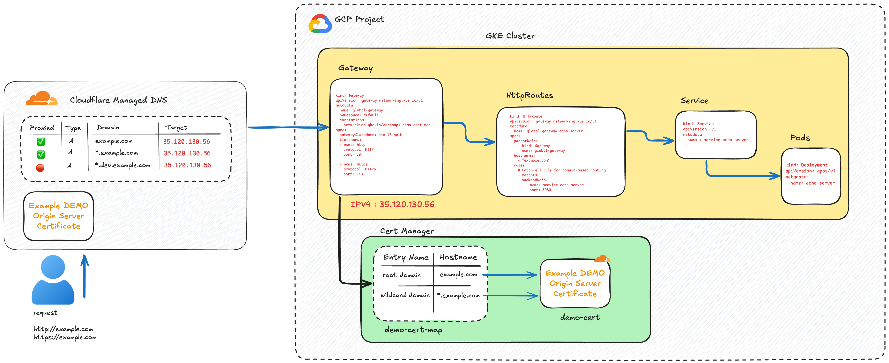
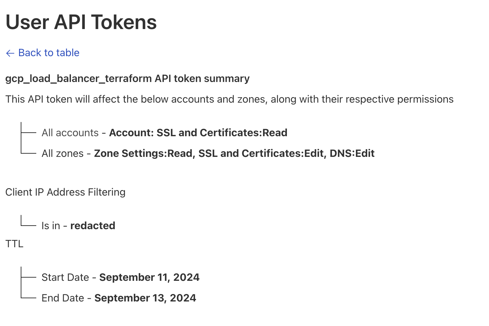

# GKE Gateway Api with Cloudflare

The Gateway API is an official Kubernetes project focused on L4 and L7 routing in Kubernetes.

This project represents the next generation of Kubernetes Ingress, Load Balancing, and Service Mesh APIs.

From the outset, it has been designed to be generic, expressive, and role-oriented with a strong separation of concerns between the infrastructure and
the application routing.

In the example below, we will deploy a simple application using the Gateway API with a domain managed on Cloudflare.

The Communcation between Cloudflare and the load balancer used an origin server certificate in `Full` or `Full strict`

Most of the configuration is available in the `terraform` directory.

### Requirements

- A working GKE cluster
- A domain managed on Cloudflare
- An api token setup on Cloudflare

### Real service Troubleshooting

Our example quite simple but for more real world scenarios, you may encounter the error below :

    no healthy upstream

The error is due to the load balancer health check not able to reach the service.

To fix this, you need to create a `HealthCheckPolicy` and attach it to the service.

https://cloud.google.com/kubernetes-engine/docs/how-to/configure-gateway-resources#configure_health_check

### Useful links

- https://cloud.google.com/kubernetes-engine/docs/concepts/gateway-api
- https://cloud.google.com/kubernetes-engine/docs/how-to/gatewayclass-capabilities
- https://cloud.google.com/kubernetes-engine/docs/how-to/secure-gateway#secure-using-secret
- https://cloud.google.com/kubernetes-engine/docs/how-to/deploying-gateways#external-gateway